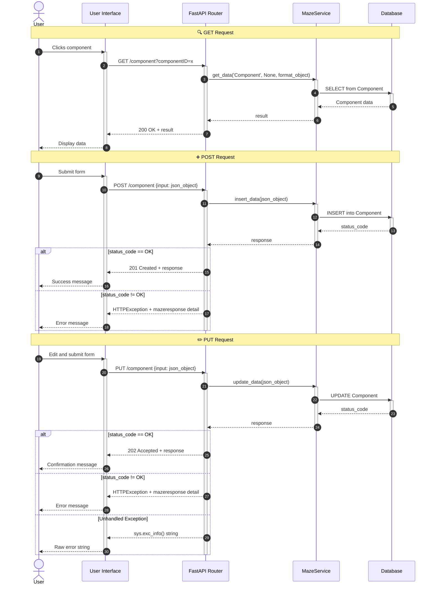

```mermaid
sequenceDiagram
    autonumber
    actor User
    participant UI as User Interface
    participant API as FastAPI Router
    participant Service as MazeService
    participant DB as Database

    Note over User,DB: 🔍 GET Request
    User->>UI: Clicks component
    activate UI
    UI->>API: GET /component?componentID=x
    activate API
    API->>Service: get_data('Component', None, format_object)
    activate Service
    Service->>DB: SELECT from Component
    activate DB
    DB-->>Service: Component data
    deactivate DB
    Service-->>API: result
    deactivate Service
    API-->>UI: 200 OK + result
    deactivate API
    UI-->>User: Display data
    deactivate UI

    Note over User,DB: ➕ POST Request
    User->>UI: Submit form
    activate UI
    UI->>API: POST /component {input: json_object}
    activate API
    API->>Service: insert_data(json_object)
    activate Service
    Service->>DB: INSERT into Component
    activate DB
    DB-->>Service: status_code
    deactivate DB
    Service-->>API: response
    deactivate Service
    alt status_code == OK
        API-->>UI: 201 Created + response
        UI-->>User: Success message
    else status_code != OK
        API-->>UI: HTTPException + mazeresponse detail
        UI-->>User: Error message
    end
    deactivate API
    deactivate UI

    Note over User,DB: ✏️ PUT Request
    User->>UI: Edit and submit form
    activate UI
    UI->>API: PUT /component {input: json_object}
    activate API
    API->>Service: update_data(json_object)
    activate Service
    Service->>DB: UPDATE Component
    activate DB
    DB-->>Service: status_code
    deactivate DB
    Service-->>API: response
    deactivate Service
    alt status_code == OK
        API-->>UI: 202 Accepted + response
        UI-->>User: Confirmation message
    else status_code != OK
        API-->>UI: HTTPException + mazeresponse detail
        UI-->>User: Error message
    else Unhandled Exception
        API-->>UI: sys.exc_info() string
        UI-->>User: Raw error string
    end
    deactivate API
    deactivate UI
```