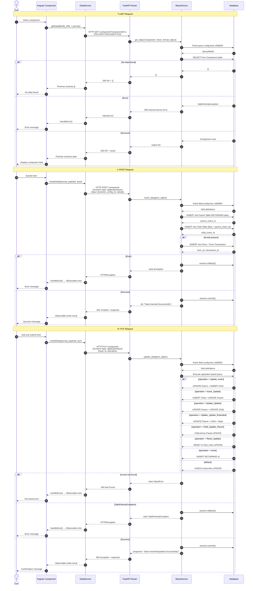

```mermaid
sequenceDiagram
    autonumber
    actor User
    participant UI as Angular Component
    participant SVC as DataService
    participant API as FastAPI Router
    participant Service as MazeService
    participant DB as Database

    Note over User,DB: 🔍 GET Request
    User->>UI: Clicks component
    UI->>SVC: getData(BASE_URL + journey)
    SVC->>API: HTTP GET /component?componentID=x<br/>[Ocp-Apim-Subscription-Key]
    API->>Service: get_data('Component', None, format_object)
    Service->>DB: Fetch query config from x000005
    DB-->>Service: QueryModel
    Service->>DB: SELECT from Component table
    alt No data found
        DB-->>Service: []
        Service-->>API: []
        API-->>SVC: 200 OK + []
        SVC-->>UI: Promise resolves []
        UI-->>User: No data found
    else Error
        DB-->>Service: SqlAlchemyException
        Service-->>API: 500 Internal Server Error
        API-->>SVC: reject(error)
        SVC-->>UI: handleError()
        UI-->>User: Error message
    else Success
        DB-->>Service: Component rows
        Service-->>API: output list
        API-->>SVC: 200 OK + result
        SVC-->>UI: Promise resolves data
        UI-->>User: Display component data
    end

    Note over User,DB: ➕ POST Request
    User->>UI: Submit form
    UI->>SVC: createData(journey, payload, 'post')
    SVC->>API: HTTP POST /component<br/>[Content-Type: application/json]<br/>{input: [{column_config_id, value}]}
    API->>Service: insert_data(json_object)
    Service->>DB: Fetch field config from x000003
    DB-->>Service: field definitions
    Service->>DB: INSERT into Parent Table RETURNING pkey
    DB-->>Service: parent_insert_id
    Service->>DB: INSERT into Child Table (fkey = parent_insert_id)
    DB-->>Service: child_insert_id
    alt formid present
        Service->>DB: INSERT into Form + Form Transaction
        DB-->>Service: form_id, transaction_id
    end
    alt Error
        Service->>DB: session.rollback()
        Service-->>API: raise Exception
        API-->>SVC: HTTPException
        SVC-->>UI: handleError() → Observable error
        UI-->>User: Error message
    else Success
        Service->>DB: session.commit()
        Service-->>API: {id, "Data Inserted Successfully"}
        API-->>SVC: 201 Created + response
        SVC-->>UI: Observable emits result
        UI-->>User: Success message
    end

    Note over User,DB: ✏️ PUT Request
    User->>UI: Edit and submit form
    UI->>SVC: createData(journey, payload, 'put')
    SVC->>API: HTTP PUT /component<br/>[Content-Type: application/json]<br/>{input, id, operation}
    API->>Service: update_data(json_object)
    Service->>DB: Fetch field config from x000003
    DB-->>Service: field definitions
    Service->>DB: Execute operation based query
    alt operation = Update_Insert
        DB-->>Service: UPDATE Parent + INSERT Child
    else operation = Insert_Update
        DB-->>Service: INSERT Child + UPDATE Parent
    else operation = Update_Update
        DB-->>Service: UPDATE Parent + UPDATE Child
    else operation = Update_Update_Extended
        DB-->>Service: UPDATE Parent + Child + State
    else operation = Child_Update_Parent
        DB-->>Service: Child drives Parent UPDATE
    else operation = Reset_Update
        DB-->>Service: RESET to NULL then UPDATE
    else operation = Insert
        DB-->>Service: INSERT RETURNING id
    else default
        DB-->>Service: CHECK exists then UPDATE
    end
    alt record not found
        Service-->>API: raise ValueError
        API-->>SVC: 404 Not Found
        SVC-->>UI: handleError() → Observable error
        UI-->>User: Not found error
    else SqlAlchemyException
        Service->>DB: session.rollback()
        Service-->>API: raise SqlAlchemyException
        API-->>SVC: HTTPException
        SVC-->>UI: handleError() → Observable error
        UI-->>User: Error message
    else Success
        Service->>DB: session.commit()
        Service-->>API: {response: "Data Inserted/Updated Successfully"}
        API-->>SVC: 202 Accepted + response
        SVC-->>UI: Observable emits result
        UI-->>User: Confirmation message
    end
```