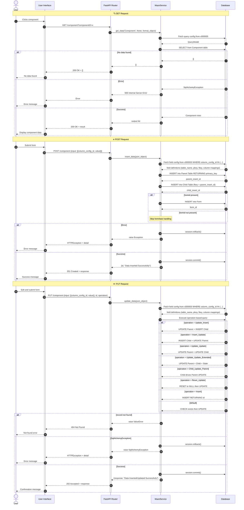

```mermaid
sequenceDiagram
    autonumber
    actor User
    participant UI as User Interface
    participant API as FastAPI Router
    participant Service as MazeService
    participant DB as Database

    Note over User,DB: 🔍 GET Request
    User->>UI: Clicks component
    activate UI
    UI->>API: GET /component?componentID=x
    activate API
    API->>Service: get_data('Component', None, format_object)
    activate Service
    Service->>DB: Fetch query config from x000005
    activate DB
    DB-->>Service: QueryModel
    deactivate DB
    Service->>DB: SELECT from Component table
    activate DB
    alt No data found
        DB-->>Service: []
        Service-->>API: []
        API-->>UI: 200 OK + []
        UI-->>User: No data found
    else Error
        DB-->>Service: SqlAlchemyException
        Service-->>API: 500 Internal Server Error
        API-->>UI: Error
        UI-->>User: Error message
    else Success
        DB-->>Service: Component rows
        deactivate DB
        Service-->>API: output list
        API-->>UI: 200 OK + result
        UI-->>User: Display component data
    end
    deactivate Service
    deactivate API
    deactivate UI

    Note over User,DB: ➕ POST Request
    User->>UI: Submit form
    activate UI
    UI->>API: POST /component {input: [{column_config_id, value}]}
    activate API
    API->>Service: insert_data(json_object)
    activate Service
    Service->>DB: Fetch field config from x000003 WHERE column_config_id IN (...)
    activate DB
    DB-->>Service: field definitions (table_name, pkey, fkey, column mappings)
    deactivate DB
    Service->>DB: INSERT into Parent Table RETURNING primary_key
    activate DB
    DB-->>Service: parent_insert_id
    deactivate DB
    Service->>DB: INSERT into Child Table (fkey = parent_insert_id)
    activate DB
    DB-->>Service: child_insert_id
    deactivate DB
    alt formid present
        Service->>DB: INSERT into Form
        activate DB
        DB-->>Service: form_id
        deactivate DB
    else formid not present
        Note over Service: Skip form/task handling
    end
    alt Error
        Service->>DB: session.rollback()
        Service-->>API: raise Exception
        API-->>UI: HTTPException + detail
        UI-->>User: Error message
    else Success
        Service->>DB: session.commit()
        Service-->>API: {id, "Data Inserted Successfully"}
        API-->>UI: 201 Created + response
        UI-->>User: Success message
    end
    deactivate Service
    deactivate API
    deactivate UI

    Note over User,DB: ✏️ PUT Request
    User->>UI: Edit and submit form
    activate UI
    UI->>API: PUT /component {input: [{column_config_id, value}], id, operation}
    activate API
    API->>Service: update_data(json_object)
    activate Service
    Service->>DB: Fetch field config from x000003 WHERE column_config_id IN (...)
    activate DB
    DB-->>Service: field definitions (table_name, pkey, fkey, column mappings)
    deactivate DB
    Service->>DB: Execute operation based query
    activate DB
    alt operation = Update_Insert
        DB-->>Service: UPDATE Parent + INSERT Child
    else operation = Insert_Update
        DB-->>Service: INSERT Child + UPDATE Parent
    else operation = Update_Update
        DB-->>Service: UPDATE Parent + UPDATE Child
    else operation = Update_Update_Extended
        DB-->>Service: UPDATE Parent + Child + State
    else operation = Child_Update_Parent
        DB-->>Service: Child drives Parent UPDATE
    else operation = Reset_Update
        DB-->>Service: RESET to NULL then UPDATE
    else operation = Insert
        DB-->>Service: INSERT RETURNING id
    else default
        DB-->>Service: CHECK exists then UPDATE
    end
    deactivate DB
    alt record not found
        Service-->>API: raise ValueError
        API-->>UI: 404 Not Found
        UI-->>User: Not found error
    else SqlAlchemyException
        Service->>DB: session.rollback()
        Service-->>API: raise SqlAlchemyException
        API-->>UI: HTTPException + detail
        UI-->>User: Error message
    else Success
        Service->>DB: session.commit()
        Service-->>API: {response: "Data Inserted/Updated Successfully"}
        API-->>UI: 202 Accepted + response
        UI-->>User: Confirmation message
    end
    deactivate Service
    deactivate API
    deactivate UI
```